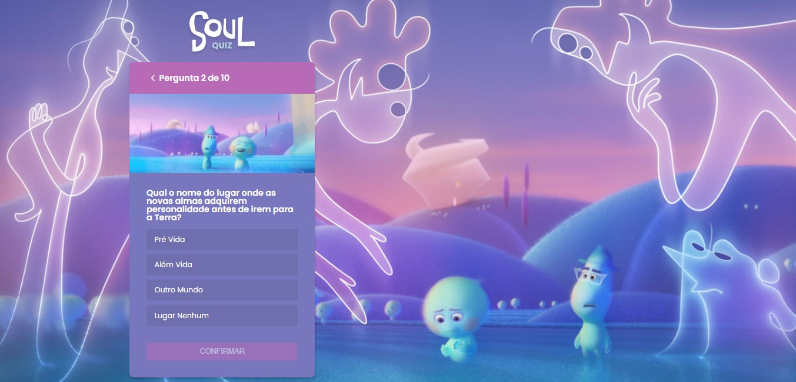

<h1 align="center">
    
</h1>

# Soul Quiz
Este projeto é um quiz sobre o filme Soul, da Pixar, desenvolvido durante a Imersão React da Alura usando Next.js.

### Tecnologias
- Next.js
- React
- JavaScript
- Styled-Component
- Eslint
- Commitizen

### Conhecimentos obtidos
- Utilização do Next.js para criação de páginas totalmente renderizadas pelo servidor, possibilitanto a otimização do conteúdo;
- Deploy automático na Vercel;
- Utilização da lib Commitizen para facilitar a criação de commits semânticos.

## 🔧 Executar no seu PC

- Clone esse repositório;
- Execute o comando `yarn` para instalar as dependências;
- Execute o comando `yarn dev` para iniciar o projeto;
- Acesse a aplicação em <strong>`http://localhost:3000`</strong>;

## 🤔 Como contribuir

- Faça um fork desse repositório;
- Crie uma branch com as suas alterações: `git checkout -b my-feature`;
- Commit suas alterações: `git commit -m 'feat: my new feature'`;
- Faça um push para a sua branch: `git push origin my-feature`.

## 📜 Licença

> Este projeto está sob a licença MIT. Veja o arquivo [LICENSE](https://github.com/jessicafpx/soulquiz-next/blob/main/LICENSE.md) para mais detalhes.

---

##### 
 <strong> < desenvolvido por <a href="https://github.com/jessicafpx"> @jessicafpx</a> /> </strong> 👋
